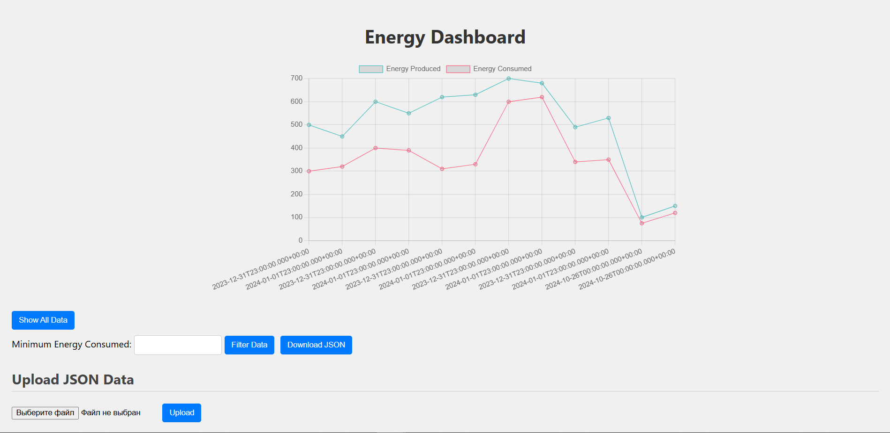
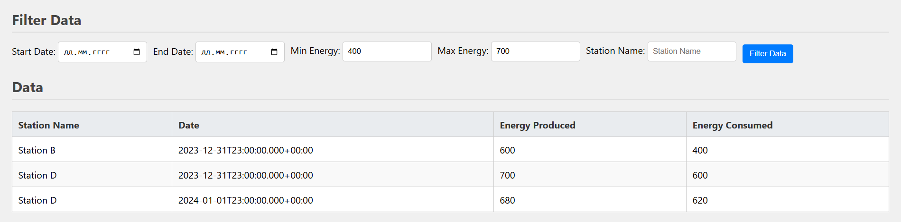
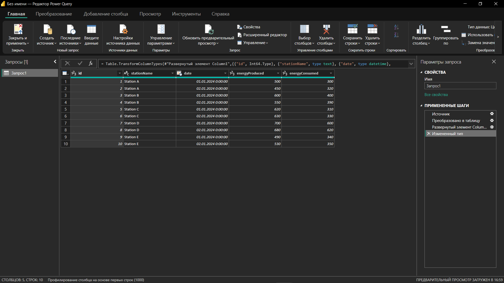
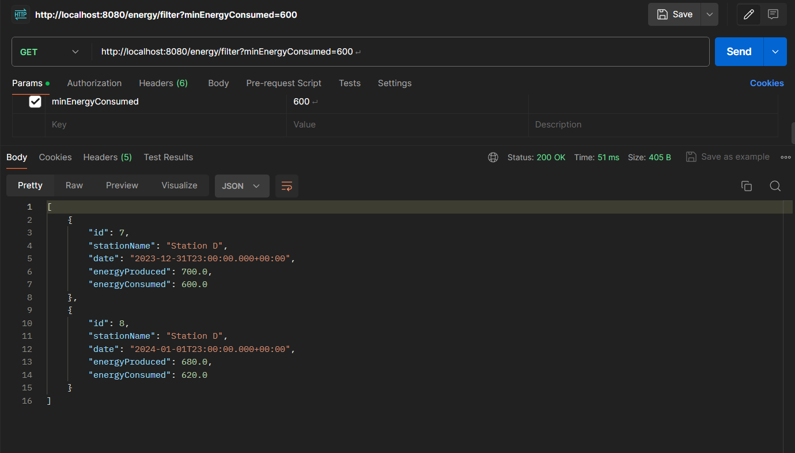

# Energy Dashboard


## Table of Contents

- [Introduction](#introduction)
- [Features](#features)
- [Technologies Used](#technologies-used)
- [Installation](#installation)
- [Running the Project](#running-the-project)
- [Usage](#usage)
    - [Data Visualization](#data-visualization)
    - [Data Filtering](#data-filtering)
    - [Power BI Integration](#power-bi-integration)
    - [Testing with Postman](#testing-with-postman)
- [Contributing](#contributing)
- [License](#license)

## Introduction

The Energy Dashboard is a web application designed to track and visualize energy consumption and production data. It provides an intuitive interface for users to manage their energy data and gain insights through various visualizations.

## Features

- Retrieve all energy consumption data
- Filter data based on multiple criteria
- Visualize data trends with interactive graphs
- Export data as JSON files
- Upload energy data from JSON files
- Compare energy data between specified dates
- Integration with Power BI for enhanced analytics

## Technologies Used

- **Frontend**: HTML, CSS, JavaScript, Chart.js
- **Backend**: Spring Boot, Java
- **Database**: MSSQL
- **Testing**: JUnit, Postman

## Installation

To set up the Energy Dashboard on your local machine, follow these steps:

1. **Clone the Repository**:
   ```bash
   git clone https://github.com/Cimba22/EnergyDashboard.git

## Running the Project

To run the Energy Dashboard project locally, follow these steps:

### Prerequisites

Before you start, ensure you have the following installed on your machine:

- **Java 11** or higher: You can download it from [Adoptium](https://adoptium.net/) or [Oracle](https://www.oracle.com/java/technologies/javase-jdk11-downloads.html).
- **Maven**: Download and install Maven from the [official website](https://maven.apache.org/download.cgi).
- **Docker** (optional, for running the SQL Server): Install Docker from the [Docker website](https://www.docker.com/get-started).
- **Postman**: Download from [Postman’s website](https://www.postman.com/downloads/) for API testing.

### Setting Up the Database

1. **Using Docker** (recommended):
    - Pull the SQL Server image:
      ```bash
      docker pull mcr.microsoft.com/mssql/server
      ```
    - Run the SQL Server container:
      ```bash
      docker run -e "ACCEPT_EULA=Y" -e "SA_PASSWORD=YourStrong!Passw0rd" -p 1433:1433 --name sqlserver -d mcr.microsoft.com/mssql/server
      ```
    - Replace `YourStrong!Passw0rd` with a secure password of your choice.
    - Username by default is: sa

2. **Without Docker**:
    - Install SQL Server on your machine.
    - Create a new database named `EnergyDashboard`.
    - Set up the database connection parameters in `application.yml` as per your configuration.


## Usage

### Data Visualization

The dashboard displays energy data trends using interactive graphs. Below is a screenshot of the data visualization feature.

 

### Data Filtering

Users can filter energy data based on various criteria such as energy consumed, dates, and station names. Here's how the filtering looks:

 

### Power BI Integration

Integrate your energy data with Power BI for advanced analytics. You can connect to the Energy Dashboard's API and pull in data for further analysis. The following image shows an example of a Power BI report.

To pull all data to PowerBi: Get Data > Web > http://localhost:8080/energy/ > Load

 

### Testing with Postman

You can test the Energy Dashboard's API using Postman. Here’s a brief overview of the endpoints available:

- **GET** `/energy/` - Retrieve all energy data
- **POST** `/energy/new` - Add new energy data
- **GET** `/energy/{id}` - Retrieve energy data by ID
- **PUT** `/energy/{id}` - Update energy data
- **DELETE** `/energy/{id}` - Delete energy data
- **GET** `/energy/filter` - Filter energy data

Below is a screenshot of a Postman request for retrieving energy data:




## License

This project is licensed under the MIT License - see the [LICENSE](./LICENSE) file for details.

